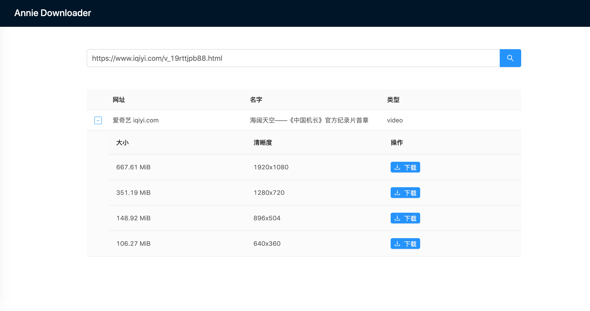

# yh-tools
some useful tools for working and life

## Annie Download

Using [Annie](https://github.com/iawia002/annie) to download resources, will download video file to /Downloads folder by default.

### prerequisite

```shell script
brew install annie

# dev
yarn dev

# deploy
yarn deploy
```

- search list


- download list

