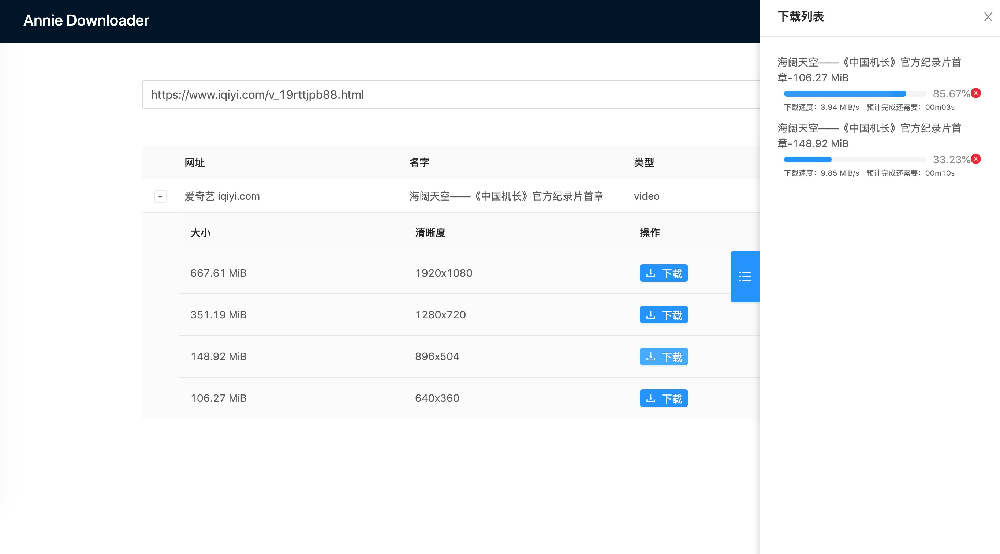

# yh-tools
some useful tools for working and life

Run Project

```shell script
# dev
yarn dev

# deploy
yarn deploy
```

## Annie Downloader

Using [Annie](https://github.com/iawia002/annie) to download resources, will download video file to /Downloads folder by default.

### prerequisite

```shell script
brew install annie
```

### Annie Downloader Flow


- search list


- download list


## JsonVisualizer

### Function List
- Download
- Copy To board
- Visualizer
- Error Pointer

### ScreenShot
- Visualizer


- Error Pointer


- Selection

